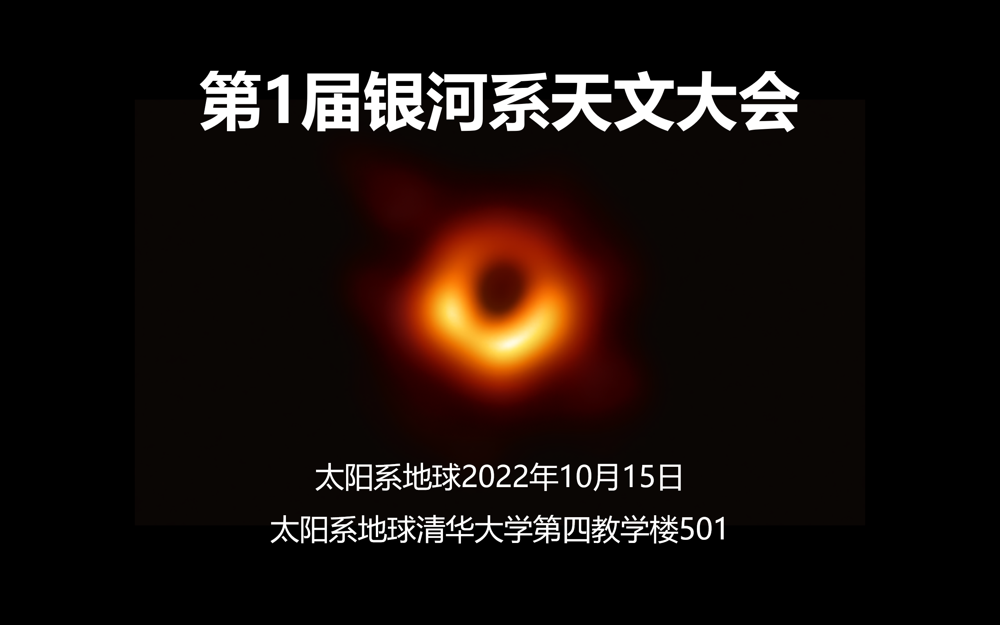

[回首页](../../README.md)

本次大会的主要内容是：

1. 参会天文学家介绍
2. 常规任务安排：每周天文时间
3. 大科学网站调研
4. 建立官方仓库，也就是你现在看到的这个GitHub
5. 参会天文学家合影

组长分享了自己对木星的一些观察。在近期数星期内，每天都可以看到木星，在同一时间，木星的位置一天比一天更加靠西。结合当前地球和木星在太阳系轨道中的相对位置，可以印证这一观点。

全组成员一致同意以上海天文台作为调研对象，后续结果敬请期待。

官方仓库在大会后立刻建立，并将持续完善。