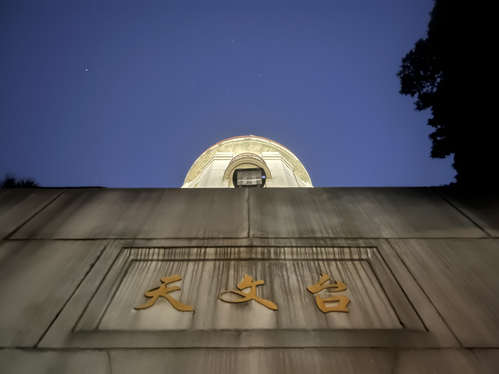
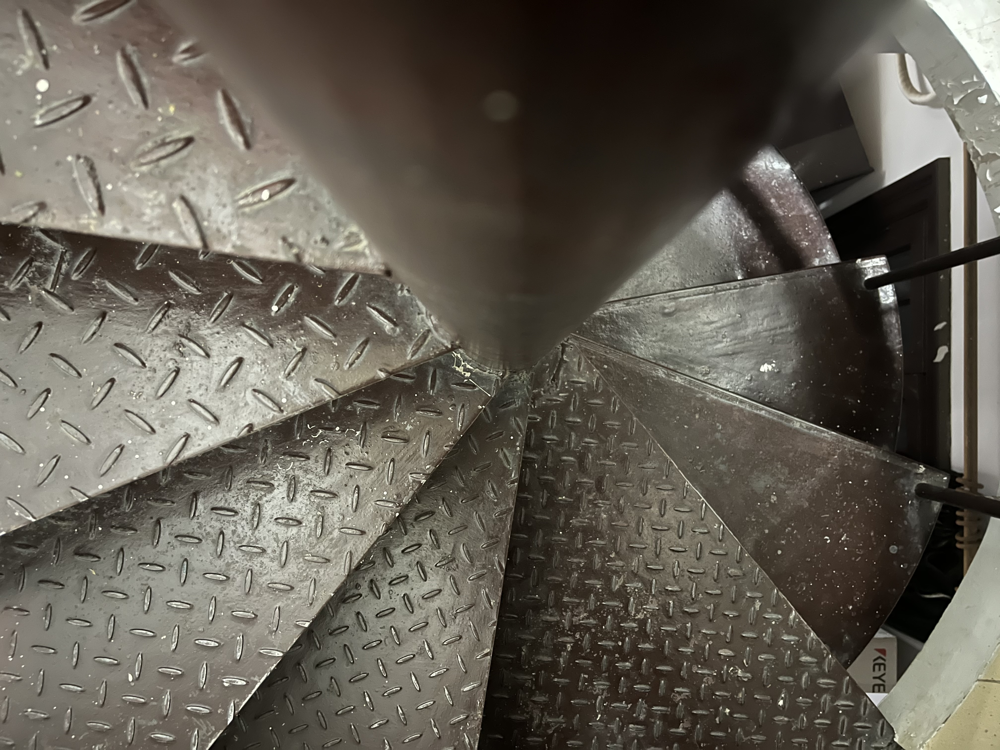
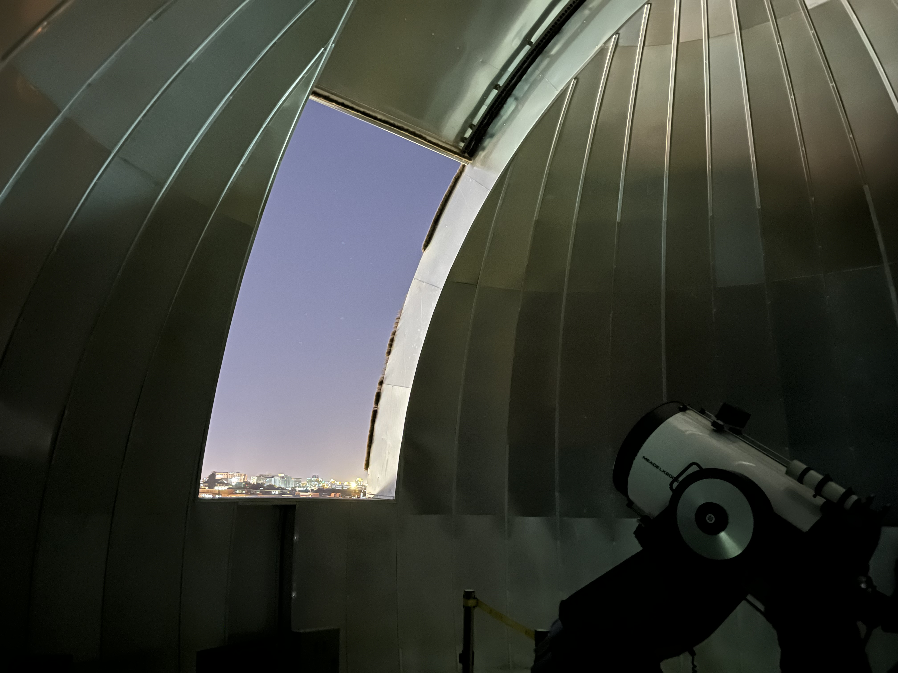
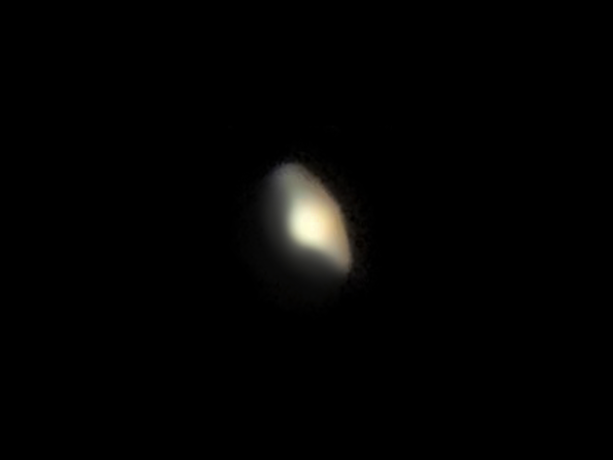

# 2022/10/16 天文台观星

[回首页](../../README.md)

2022年10月16日19:20，我们小组来到天文台进行观星活动。

大家都是第一次来到学校天文台，感到十分新鲜。天文台坐落于清华园西边，理科楼附近，它的入口掩映在一片绿树林之中，显得尤其静谧。站在天文台下仰望夜空，总是使人感到一种深邃与肃穆。

通过盘旋的楼梯一路向上，可以来到天文台顶部。天文望远镜之所以架设在幽静的高处，是为了尽量减少地面大气扰动对天文观测的影响。如果天体的像在望远镜视野中剧烈晃动，通常就是大气扰动的结果。

老师和助教将天文望远镜调试完毕，它静静地凝视着土星的方向。

下面是组长拍摄的土星照片（经过计算机修复）。

略有遗憾的是，组长的iPhone 13没能发挥出最佳状态，土星和土星环模糊在一起。但肉眼对镜观看则十分清晰，这种感受只有亲身体验之后才会理解。
