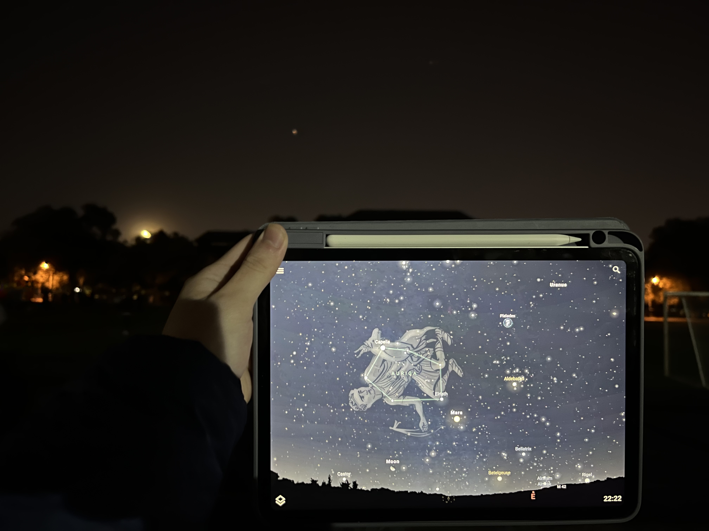
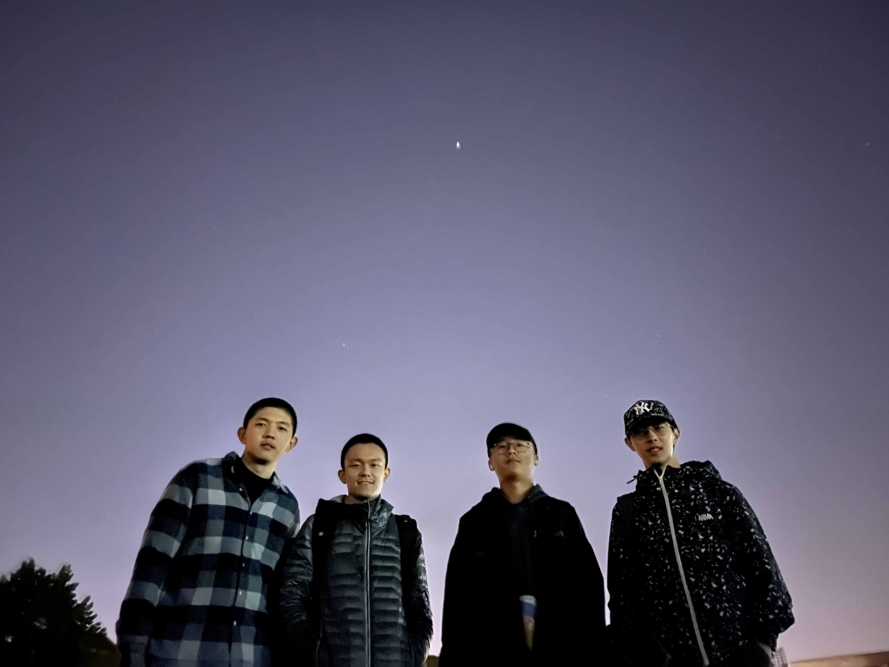

# 2022/10/16 天文台观星

[回首页](../../README.md)

2022年10月16日22:10，紧接着刚才的天文台观星，我们小组又在助教的带领下，来到西大操场继续使用肉眼观星。

我们首先认出的是南边明亮的木星、东边红色的火星，在亮星的周围散布着星星点点的暗星，我们借助观星软件进行辨识。下图天空中可以清晰地看到月球和火星。

在助教的指导下（激光笔是个好东西，我也要去搞一个），我们认识了大方框、飞马座、仙女座、英仙座、仙后座、金牛座、白羊座、天鹅座、M13星团，今天的运气真是不错啊。

从22:10一直到23:00，我们看到天空中大部分的行星绕着北极星（找到了仙后座，就很容易找到北极星）旋转了一定角度，距离越远，转过的角度越大。一个明显的例子是英仙座，刚开始看时我们只需略微抬头，到后来我们不得不把头仰到很大的程度。

最后是小组成员在星空下的合影。图中天上的亮星当然是木星。

