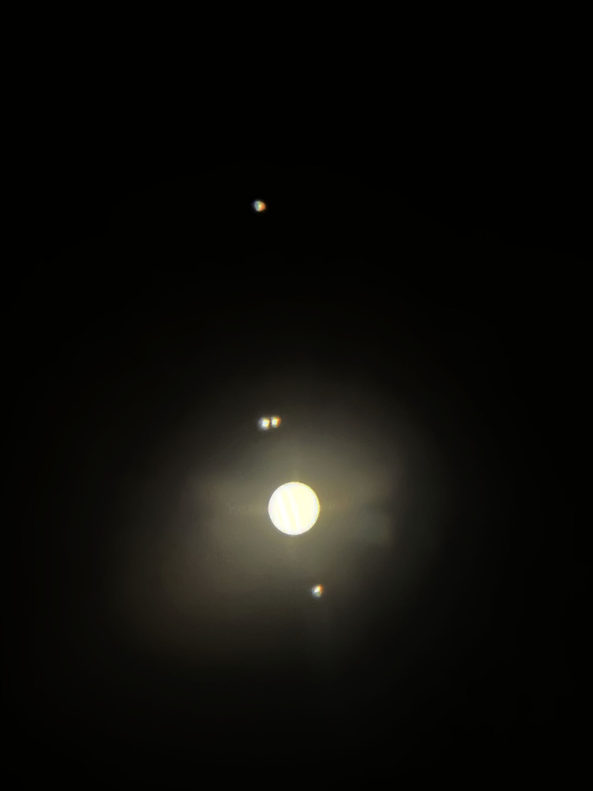

# 2022/10/23 天文台观星

[回首页](../../README.md)

2022年10月23日20:10，我们来到天文台进行观星。

本次的目标是木星。我们期待看到木星的四颗卫星，以及木星表面的条纹，如果运气好，希望能一览著名的木星大红斑。

在望远镜的视野当中，我们看到了四颗卫星，有两颗在视觉上靠得很近，需要仔细分辨。木星表面可以清晰看见两条暗纹，如果眼睛离目镜的距离合适，可以看到更多。

遗憾的是，没有同学看到大红斑，难道它今天心情不好？

