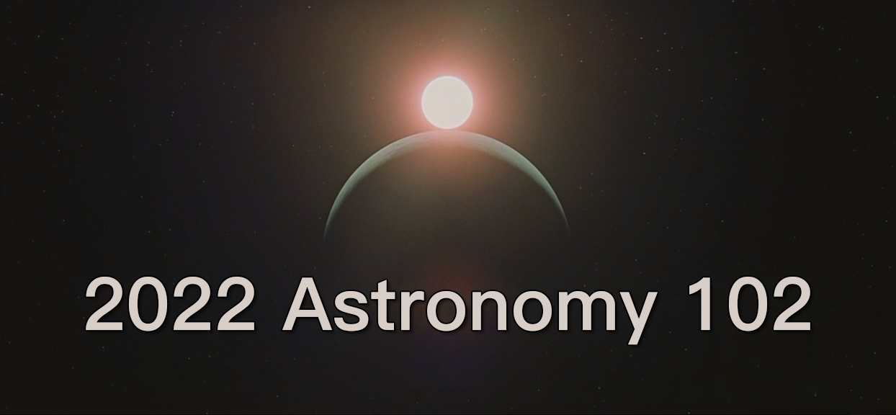

# 简介

这是清华大学《天文学导论》2022秋季班102小组的官方GitHub仓库。我们会定期更新小组的最新动态，包括活动记录、资料分享、集体合影，当然还有我们的组会——银河系天文大会。

# 银河系天文大会

- 2022/10/15 [第1届银河系天文大会](Congress/Congress1/Congress1.md)

# 集体观星

- 2022/10/16 [天文台观星](Observation/Observation1/Observation1.md)
- 2022/10/16 [西大操场观星](Observation/Observation2/Observation2.md)
- 2022/10/17 [课后观星](Observation/Observation3/Observation3.md)
